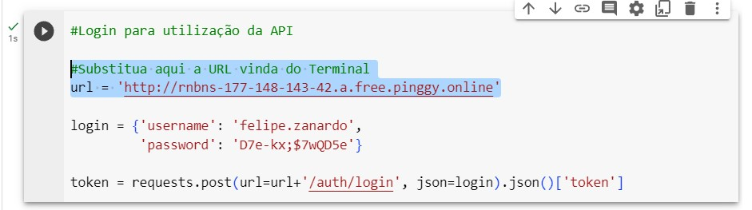

# Desafio de Projeto - Explorando IA Generativa em um Pipeline de ETL com Python

O programa sugere 5 dezenas para apostar na Quina (Loteria Federal) com base nos dados vindos em todos os sorteios da API da Caixa.

Foi feito uma Pipeline de ETL em Python seguindo os seguintes passos:

- Extract: Busca por dados de todos os sorteios da Quina já realizados
- Transform: Conta e seleciona as 10 dezenas mais sorteadas e através de uma escolha randômica sugere 5 dezenas para se fazer a aposta.
- Load: Utiliza as dezenas do item anterior e faz um requisição do tipo POST na API 'MinhaQuina' disponível em: [https://github.com/FelipeBZanardo/Projeto-Final-Web-II](https://github.com/FelipeBZanardo/Projeto-Final-Web-II)  

## ✒️Autor
- [Felipe Zanardo](https://github.com/FelipeBZanardo)

## 📋Descrição

Prepare-se para uma jornada prática pelo mundo da Ciência de Dados neste vídeo! Vamos construir um pipeline ETL (Extração, Transformação e Carregamento), demonstrando a relação entre dados, Inteligência Artificial (IA) e APIs. Extração: A aventura começa com uma planilha simples, de onde extrairemos os IDs dos usuários. Depois, usaremos esses IDs para acessar a API da 'Santander Dev Week 2023' e obter dados mais detalhados, um processo que evidencia a versatilidade na coleta de informações em Ciência de Dados. Transformação: Adentraremos o universo da IA com o GPT-4 da OpenAI, transformando esses dados em mensagens personalizadas de marketing. Veremos como a IA pode ser empregada de maneira inovadora e prática! Carregamento: Finalizaremos o processo enviando essas mensagens de volta para a API da 'Santander Dev Week 2023'. Este passo ilustra como dados transformados são reintegrados em sistemas, completando o ciclo de um pipeline ETL.

## Demonstração

  

## 📋  Pré-requisitos
- Ter instalado o **[Python](https://www.python.org/downloads/)**;
- Ter instalado uma IDE (Sugestão: **[IntelliJ](https://www.jetbrains.com/pt-br/idea/)**);
- Ter instalado **[Git](https://git-scm.com/)**.

## ⚙️ Executar o projeto:
### Back-end:
1) Fazer o clone do repositório do projeto [Projeto-Final-Web-II](https://github.com/FelipeBZanardo/Projeto-Final-Web-II);
2) Selecionar o diretório "Back-end/minha-quina", abrir o projeto na IDE e dar play na aplicação "MinhaQuinaApplication";
3) Abrir o Terminal e digitar:
	`ssh -p 443 -R0:localhost:8080 -L4300:localhost:4300 qr@a.pinggy.io`
4) Copiar a URL que aparecerá no terminal (essa URL será utilizada no Google Colab a seguir)

### Google Colab:

1) Abrir o projeto através do link: [https://colab.research.google.com/drive/1Mu-x7HfBnwq4mMPn6ot0wG_OFHk60548?usp=sharing](https://colab.research.google.com/drive/1Mu-x7HfBnwq4mMPn6ot0wG_OFHk60548?usp=sharing)
2) Fazer o download do arquivo [banco_dados.csv](https://github.com/FelipeBZanardo/Desafio_Projeto_ETL_DIO/blob/main/banco_dados.csv) e fazer o upload na pasta do Colab  
3) Colar a URL copiada do item anterior no local indicado do Colab conforme imagem abaixo :

  

4) Rodar cada trecho de código do Colab e verificar se a resposta foi criada corretamente.
## 🛠️ Tecnologias Utilizadas

* [IntelliJ](https://www.jetbrains.com/pt-br/idea/) - IDE para Back-end
* [Google Colab](https://colab.research.google.com/drive/1Mu-x7HfBnwq4mMPn6ot0wG_OFHk60548?usp=sharing)
* [Pinggy](https://pinggy.io/) - URLs públicos para Localhost.

## 📈 Melhorias futuras

- Fazer o deploy da Aplicação Back-end para não precisar mais utilizar o Pinggy.
- Utilizar a Inteligência artificial para gerar as dezenas da aposta.
